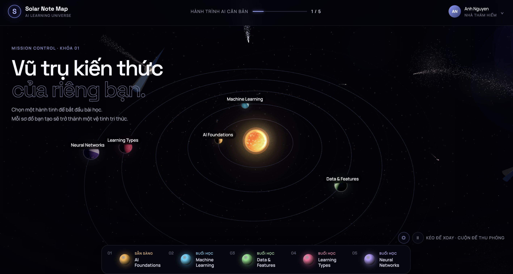

# Solar Note Map

> Biến hành trình học AI thành một vũ trụ 3D, nơi mỗi bài học là một hành tinh và mỗi ghi chú là một hạt kiến thức có thể kết nối.



## Giới thiệu

Solar Note Map là một ứng dụng web học tập tương tác được xây dựng bằng React, TypeScript và Three.js. Thay vì ghi chú theo danh sách, người học khám phá khóa AI căn bản qua một hệ hành tinh 3D, sau đó tự tổ chức kiến thức thành sơ đồ trực quan cho từng bài.

Ứng dụng hiện chạy hoàn toàn trên trình duyệt, không cần tài khoản hay backend. Sơ đồ và nhận xét được lưu cục bộ bằng `localStorage`.

## Tính năng

### Khám phá vũ trụ học tập

- Hệ hành tinh 3D có quỹ đạo, vành đai tiểu hành tinh, vệ tinh, sao, tinh vân và sao chổi.
- Kéo để xoay, cuộn để thu phóng và nhấp vào hành tinh để mở bài học.
- Bật hoặc ẩn quỹ đạo; tạm dừng hoặc tiếp tục chuyển động.
- Hiển thị vệ tinh tri thức khi người học đã lưu sơ đồ.

### Học theo từng nhiệm vụ

Mỗi bài học có phần mô tả, câu hỏi dẫn đường và quy trình gợi ý. Nội dung hiện gồm 5 chủ đề:

1. AI Foundations
2. Machine Learning
3. Data & Features
4. Learning Types
5. Neural Networks

### Xây dựng sơ đồ kiến thức

- Tạo, chỉnh sửa, kéo thả và xóa các hạt kiến thức.
- Viết tiêu đề, ghi chú và chọn một trong 5 mức độ quan trọng.
- Tạo liên kết giữa các hạt để biểu diễn quan hệ giữa các ý tưởng.
- Phóng to, thu nhỏ hoặc đặt lại vùng làm việc.
- Lưu một sơ đồ riêng cho từng bài học.

### Không gian cộng đồng

- Xem các sơ đồ học viên mẫu và nội dung của từng node.
- Ghim node để đọc chi tiết hoặc viết nhận xét đúng ngữ cảnh.
- Phản hồi nhận xét và lưu nội dung đánh giá trên trình duyệt.

> [!NOTE]
> Danh sách học viên và sơ đồ cộng đồng hiện là dữ liệu minh họa. Ứng dụng chưa đồng bộ dữ liệu giữa các thiết bị.

## Công nghệ

| Thành phần | Công nghệ |
| --- | --- |
| Giao diện | React 19, TypeScript |
| Đồ họa 3D | Three.js, React Three Fiber, Drei |
| Styling | Tailwind CSS 4, CSS |
| Build tool | Vite 7 |
| Đóng gói | vite-plugin-singlefile |
| Lưu trữ | Web Storage API (`localStorage`) |

## Bắt đầu

### Yêu cầu

- Node.js `20.19+` hoặc `22.12+`
- npm
- Trình duyệt hiện đại có hỗ trợ WebGL

### Cài đặt

```bash
git clone https://github.com/Datghb/SolarNoteMap2.git
cd SolarNoteMap2
npm install
npm run dev
```

Mở địa chỉ Vite hiển thị trong terminal, mặc định là [http://localhost:5173](http://localhost:5173).

### Build production

```bash
npm run build
npm run preview
```

Lệnh `npm run build` tạo bản tĩnh trong `dist/`. Cấu hình hiện tại sử dụng `vite-plugin-singlefile`, vì vậy mã JavaScript và CSS được nhúng vào `dist/index.html`, thuận tiện để triển khai trên các dịch vụ static hosting.

## Cách sử dụng

| Thao tác | Cách thực hiện |
| --- | --- |
| Xoay góc nhìn | Kéo chuột trên không gian 3D |
| Thu phóng | Cuộn chuột |
| Di chuyển camera | Kéo bằng chuột phải |
| Mở bài học | Nhấp vào hành tinh hoặc chọn bài ở thanh phía dưới |
| Bật/tắt quỹ đạo | Nhấp nút `◎` |
| Dừng/chạy chuyển động | Nhấp nút `Ⅱ` hoặc `▶` |
| Tạo liên kết | Chọn node nguồn → **Tạo liên kết** → chọn node đích |
| Lưu sơ đồ | Chọn **Lưu sơ đồ** trong thanh công cụ |

## Cấu trúc dự án

```text
SolarNoteMap2/
├── src/
│   ├── components/
│   │   ├── LearningConsole.tsx  # Bài học, sơ đồ và khu vực cộng đồng
│   │   ├── Planet.tsx           # Hình học, hiệu ứng và tương tác hành tinh
│   │   ├── SolarSystem.tsx      # Hệ hành tinh, quỹ đạo và vệ tinh
│   │   ├── SpaceObjects.tsx     # Các hiệu ứng không gian
│   │   └── Sun.tsx              # Mặt trời và hiệu ứng phát sáng
│   ├── data/
│   │   └── lessons.ts           # Nội dung và màu sắc của bài học
│   ├── utils/
│   │   └── cn.ts                # Tiện ích ghép class CSS
│   ├── App.tsx                  # Bố cục và trạng thái cấp ứng dụng
│   ├── index.css                # Style toàn cục và responsive
│   └── main.tsx                 # Entry point React
├── image.png                    # Ảnh preview
├── index.html
├── package.json
├── tsconfig.json
└── vite.config.ts
```

## Dữ liệu lưu trên trình duyệt

Ứng dụng sử dụng hai nhóm key:

```text
solar-note-map:<lesson-id>
solar-note-reviews:<lesson-id>:<student-name>
```

Xóa site data hoặc `localStorage` của trình duyệt sẽ xóa toàn bộ sơ đồ và nhận xét đã lưu. Không nên dùng dữ liệu hiện tại như một bản sao lưu lâu dài.

## Tùy biến nội dung

Để thêm hoặc sửa bài học, cập nhật mảng `LESSONS` trong `src/data/lessons.ts`. Mỗi phần tử định nghĩa nội dung, màu chủ đạo và bảng màu của hành tinh:

```ts
{
  id: 'prompt-engineering',
  name: 'Prompt Engineering',
  shortName: 'Prompt Design',
  subtitle: 'Buổi 06 · Tín hiệu dẫn đường',
  description: 'Học cách thiết kế chỉ dẫn rõ ràng cho mô hình AI.',
  prompt: 'Một prompt tốt cần cung cấp những ngữ cảnh và ràng buộc nào?',
  color: '#7dd3fc',
  colors: ['#dbeafe', '#38bdf8', '#164e63'],
}
```

`SolarSystem` sinh hành tinh từ danh sách này, nên bài mới sẽ tự xuất hiện trong không gian 3D và thanh điều hướng.

## Giới hạn hiện tại

- Chưa có backend, đăng nhập hoặc đồng bộ đám mây.
- Nội dung cộng đồng và hồ sơ người dùng là dữ liệu mẫu.
- Chỉ số tiến độ `1 / 5` trên thanh đầu trang hiện là nội dung tĩnh.
- Hiệu năng phụ thuộc vào khả năng WebGL/GPU của thiết bị.
- Repo chưa khai báo license.

## Hướng phát triển

- Đồng bộ sơ đồ theo tài khoản và thiết bị.
- Cho phép chia sẻ, cộng tác và đánh giá sơ đồ thật.
- Tính tiến độ tự động từ trạng thái từng bài học.
- Bổ sung quiz, flashcard và nhiều lộ trình học.
- Thêm kiểm thử tự động và chế độ giảm hiệu ứng cho thiết bị yếu.

## Đóng góp

Bạn có thể fork repo, tạo branch cho thay đổi, kiểm tra bản build rồi mở pull request:

```bash
npm run build
```

Khi báo lỗi, vui lòng kèm trình duyệt, hệ điều hành và các bước tái hiện. Nếu thay đổi giao diện 3D, ảnh hoặc video ngắn trước/sau sẽ giúp việc review dễ hơn.

## License

Dự án hiện chưa có file `LICENSE`. Mọi quyền mặc định thuộc về chủ sở hữu repository cho đến khi một giấy phép được bổ sung.
