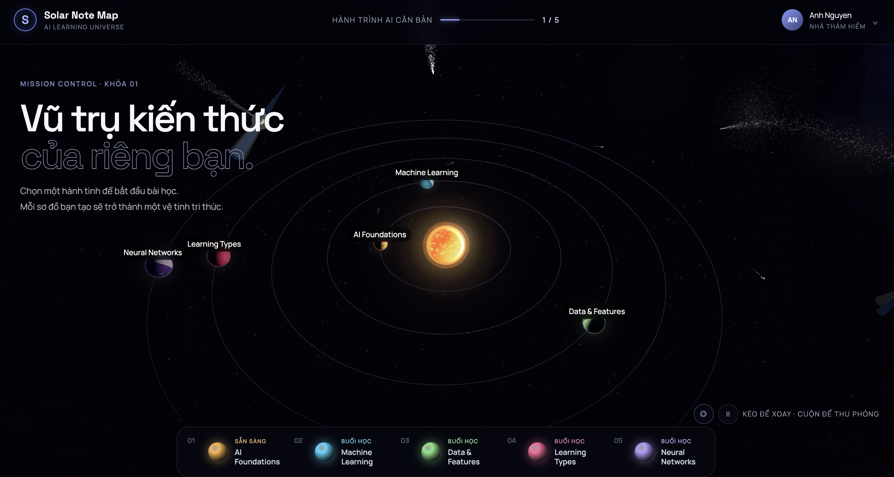

# Solar Note Map

> Turn your AI learning journey into a 3D universe where every lesson is a planet and every note is a connectable knowledge node.



## Overview

Solar Note Map is an interactive learning application built with React, TypeScript, and Three.js. Instead of organizing notes as a list, learners explore a beginner AI course through a 3D planetary system and build a visual knowledge map for each lesson.

The application uses a small Node server to protect the OpenAI API key. Live map generation calls the OpenAI Responses API and falls back to browser-based concept detection when the API is unavailable. Knowledge maps and review comments are stored locally using `localStorage`.

## Features

### Explore a Learning Universe

- A 3D planetary system with orbits, an asteroid belt, satellites, stars, nebulae, and comets.
- Drag to rotate, scroll to zoom, and select a planet to open its lesson.
- Show or hide orbital paths and pause or resume planetary motion.
- Display a knowledge satellite after the learner saves a map.

### Follow Lesson Missions

Each lesson includes a description, a guiding question, and a suggested learning process. The current course contains five topics:

1. AI Foundations
2. Machine Learning
3. Data & Features
4. Learning Types
5. Neural Networks

Each lesson opens as an interactive slide workspace. Learners can select concepts, mark a slide as understood or unclear, write slide-specific notes, and watch a compact knowledge map grow beside the lecture.

The first lesson uses the bundled `day01-llm-foundation.pdf` as its 42-page lecture deck. The PDF remains selectable and sharp in the browser. Learners can navigate pages, place contextual pins directly over a page, write page-specific notes, and open a community question linked to that exact PDF page.

### Build Knowledge Maps

- Capture an explanation naturally in the learner's own words while the map updates in real time.
- Store notes separately for each slide and combine them with slide context for AI analysis.
- Preview the evolving map without leaving the lecture, then open the full graph when needed.
- Generate concepts and semantic relationships through OpenAI Structured Outputs after a short typing debounce.
- Fall back to local concept detection when OpenAI is unavailable.
- Render an interactive radial knowledge constellation with React Flow.
- Focus one branch at a time while unrelated concepts fade into the background.
- Review, edit, confirm, drag, and delete suggested knowledge nodes.
- Use an AI-style reflection review to identify strengths and a question worth exploring next.
- Zoom in, zoom out, or reset the workspace.
- Save a separate map for each lesson.

### Ask the Learning Community

- Ask questions that are linked to the exact lecture slide where confusion appears.
- Filter discussions by slide, vote for questions, and reply with another explanation.
- Jump from a discussion back to its source slide.
- Start a contextual question directly from the lecture workspace.

> [!NOTE]
> Community questions currently contain demonstration data and are stored in the browser. The application does not yet synchronize discussions between real users or devices.

## Tech Stack

| Area | Technology |
| --- | --- |
| Interface | React 19, TypeScript, React Flow |
| 3D graphics | Three.js, React Three Fiber, Drei |
| AI | OpenAI Responses API, Structured Outputs |
| Graph layout | Custom deterministic radial constellation |
| Styling | Tailwind CSS 4, CSS |
| Build tool | Vite 7 |
| Bundling | vite-plugin-singlefile |
| Storage | Web Storage API (`localStorage`) |

## Getting Started

### Requirements

- Node.js `20.19+` or `22.12+`
- npm
- A modern browser with WebGL support

### Installation

```bash
git clone https://github.com/Datghb/SolarNoteMap2.git
cd SolarNoteMap2
npm install
npm run dev
```

Create `.env.local` before running the application:

```env
OPENAI_API_KEY=sk-your-key-here
OPENAI_MODEL=gpt-5.6-sol
```

Never prefix the key with `VITE_`; the browser must not receive it. `npm run dev` starts Vite and the protected API server together.

Open the address shown by Vite in your terminal. The default is [http://localhost:5173](http://localhost:5173).

### Production Build

```bash
npm run build
npm start
```

Running `npm run build` creates a static production bundle in `dist/`. The current configuration uses `vite-plugin-singlefile`, which embeds the JavaScript and CSS in `dist/index.html` for convenient deployment to static hosting services.

## Controls

| Action | Control |
| --- | --- |
| Rotate the view | Drag over the 3D scene |
| Zoom | Scroll the mouse wheel |
| Move the camera | Right-click and drag |
| Open a lesson | Select a planet or use the lesson dock at the bottom |
| Show or hide orbits | Select the `◎` button |
| Pause or resume motion | Select the `Ⅱ` or `▶` button |
| Create a live map | Write in the notes panel and watch the map update automatically |
| Save a map | Select **Save Map** in the toolbar |

## Project Structure

```text
SolarNoteMap2/
├── src/
│   ├── components/
│   │   ├── LearningConsole.tsx  # Lessons, knowledge maps, and community space
│   │   ├── Planet.tsx           # Planet geometry, effects, and interactions
│   │   ├── SolarSystem.tsx      # Planetary system, orbits, and satellites
│   │   ├── SpaceObjects.tsx     # Deep-space visual effects
│   │   └── Sun.tsx              # Sun and glow effects
│   ├── data/
│   │   └── lessons.ts           # Lesson content and color palettes
│   ├── utils/
│   │   └── cn.ts                # CSS class-name utility
│   ├── App.tsx                  # Application layout and top-level state
│   ├── index.css                # Global and responsive styles
│   └── main.tsx                 # React entry point
├── image.png                    # Preview image
├── index.html
├── package.json
├── tsconfig.json
└── vite.config.ts
```

## Browser Storage

The application uses two groups of storage keys:

```text
solar-note-map:<lesson-id>
solar-note-reviews:<lesson-id>:<student-name>
solar-slide-notes:<lesson-id>
solar-slide-pins:<lesson-id>
solar-community-questions:<lesson-id>
```

Clearing the browser's site data or `localStorage` removes all saved maps and reviews. The current storage mechanism should not be treated as a long-term backup.

## Customizing Lessons

To add or edit a lesson, update the `LESSONS` array in `src/data/lessons.ts`. Each entry defines the lesson content, primary color, and planet palette:

```ts
{
  id: 'prompt-engineering',
  name: 'Prompt Engineering',
  shortName: 'Prompt Design',
  subtitle: 'Lesson 06 · Navigation Signals',
  description: 'Learn how to write clear instructions for an AI model.',
  prompt: 'What context and constraints should an effective prompt provide?',
  color: '#7dd3fc',
  colors: ['#dbeafe', '#38bdf8', '#164e63'],
}
```

`SolarSystem` generates planets from this list, so new lessons automatically appear in both the 3D scene and the navigation dock.

## Current Limitations

- The included Node server has basic in-memory rate limiting but no user authentication or cloud synchronization.
- Community content and the user profile contain sample data.
- The `1 / 5` progress indicator in the header is currently static.
- Performance depends on the device's WebGL and GPU capabilities.
- The repository does not currently declare a license.

## Roadmap

- Synchronize maps across user accounts and devices.
- Support real map sharing, collaboration, and peer review.
- Calculate course progress from lesson completion data.
- Add quizzes, flashcards, and more learning paths.
- Add automated tests and a reduced-effects mode for lower-powered devices.

## Contributing

Fork the repository, create a branch for your changes, verify the production build, and open a pull request:

```bash
npm run build
```

When reporting a bug, include your browser, operating system, and reproduction steps. For 3D interface changes, a short before-and-after recording or screenshot will make the review process easier.

## License

This project does not currently include a `LICENSE` file. All rights remain with the repository owner until a license is added.
